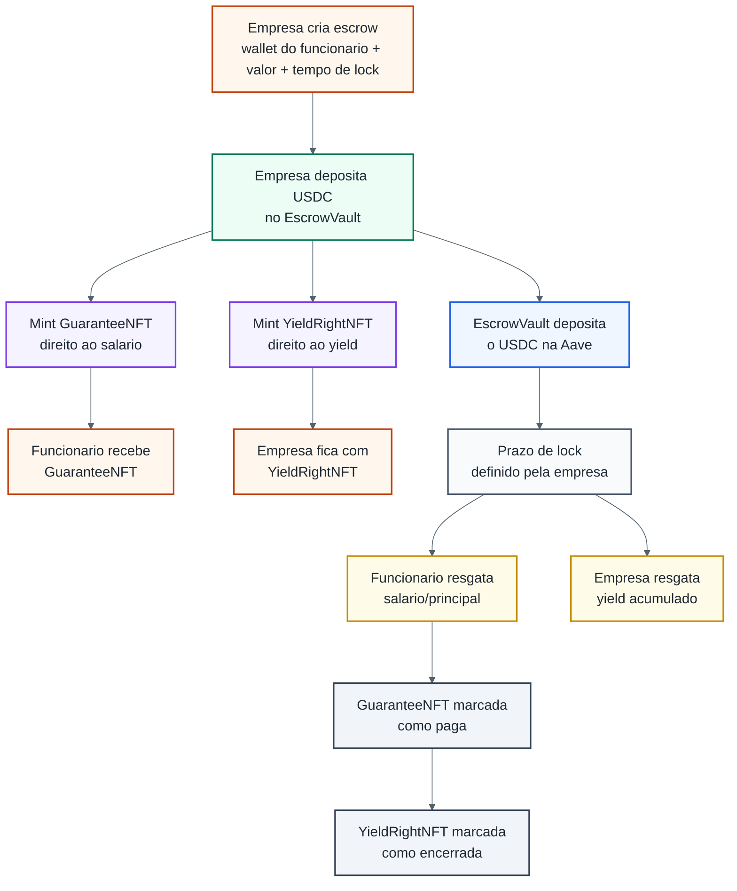
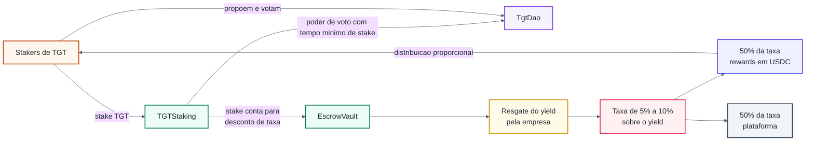

# Tesserate

MVP de protocolo Web3 para escrow com rendimento: a empresa deposita USDC, o
principal fica reservado ao funcionario e o rendimento fica separado para a
empresa. O protocolo usa NFTs para representar esses direitos, staking de TGT
para governanca e recompensas, Chainlink para precificacao em USD e um mini
frontend com `ethers.js` para demonstrar os fluxos on-chain.

## Alinhamento com o trabalho

O PDF pede um MVP com ERC-20, NFT, staking, DAO simplificada, oraculo,
integracao Web3 e deploy em testnet. Neste projeto, a integracao Web3 esta no
mini frontend em `frontend/`, que usa `ethers.js` direto no navegador. Nao ha
pasta `backend` nem API HTTP separada neste repo.

| Requisito do PDF | Implementacao no projeto |
| --- | --- |
| Token ERC-20 | `contracts/TesserateGovernanceToken.sol` (`TGT`) |
| NFT ERC-721 ou ERC-1155 | `GuaranteeNFT` e `YieldRightNFT`, ambos ERC-721 |
| Contrato de staking com recompensa | `contracts/TGTStaking.sol`, com rewards em USDC |
| Governanca simples | `contracts/TgtDao.sol`, baseada no poder de voto do staking |
| Oraculo | `contracts/ChainlinkPriceOracle.sol`, usando feeds Chainlink |
| Integracao Web3 | Mini frontend em `frontend/index.html` + `frontend/app.js` |
| Deploy em testnet | Deploy na Base Sepolia, com enderecos e links abaixo |
| README explicativo | Este arquivo |
| Relatorio tecnico, video e auditoria | Artefatos externos exigidos pelo PDF |

## Problema

O Tesserate resolve um caso de escrow entre empresa e funcionario:

- a empresa deposita um valor em USDC;
- o funcionario recebe um NFT que representa o direito ao principal;
- a empresa recebe outro NFT que representa o direito ao rendimento;
- o protocolo aplica taxa sobre o rendimento, com desconto por saldo/stake de
  TGT;
- parte da taxa financia recompensas para stakers;
- stakers com poder de voto maduro podem participar da DAO.

## Arquitetura

### Fluxo principal do escrow



### Staking, DAO e distribuicao da taxa



O mini frontend em `frontend/` assina transacoes na wallet do usuario para o
`EscrowVault`, `TGTStaking` e `TgtDao`. O `EscrowVault` usa o
`ChainlinkPriceOracle` para validar o valor em USD do deposito.

## Escolha dos padroes

- **ERC-20 (`TGT`)**: usado para governanca, staking, tiers de desconto e poder
  economico fungivel dentro do protocolo.
- **ERC-721 (`GuaranteeNFT`)**: representa de forma unica o direito do
  funcionario ao principal de um escrow especifico.
- **ERC-721 (`YieldRightNFT`)**: representa de forma unica o direito da empresa
  ao rendimento daquele mesmo escrow.

## Estrutura do projeto

```text
contracts/   Contratos Solidity do protocolo e mocks de teste
frontend/    Mini frontend estatico com ethers.js
ignition/    Modulos e parametros de deploy Hardhat Ignition
scripts/     Scripts auxiliares de sync, faucet, smoke test e servidor local
test/        Testes Hardhat
types/       Tipagens geradas dos contratos
docs/        Documentacao auxiliar de deploy
```

Nao existe pasta `backend/` neste projeto. As leituras e escritas Web3 da demo
sao feitas diretamente pelo frontend, com transacoes assinadas pela wallet do
usuario.

## Contratos

### `contracts/TesserateGovernanceToken.sol`

- Token de governanca `TGT`.
- Supply fixo de `1_000_000 * 10^18`.
- Sem funcao publica de mint para inflacao futura.

### `contracts/GuaranteeNFT.sol`

- NFT ERC-721 que representa o direito do funcionario ao saque do principal.
- O mint e controlado pelo `EscrowVault`.

### `contracts/YieldRightNFT.sol`

- NFT ERC-721 que representa o direito da empresa ao saque do rendimento.
- O mint e controlado pelo `EscrowVault`.

### `contracts/EscrowVault.sol`

- Recebe deposito da empresa em USDC.
- Envia o deposito para a Aave.
- Valida o valor em USD usando `ChainlinkPriceOracle`.
- Expoe `getDepositUsdValue(...)` para preview no frontend.
- Cria `GuaranteeNFT` para o funcionario e `YieldRightNFT` para a empresa.
- Libera principal ao dono do `GuaranteeNFT` depois do lock.
- Libera rendimento ao dono do `YieldRightNFT` depois do lock.
- Se o principal for liberado antes do claim manual do rendimento, liquida o
  rendimento pendente para o dono do `YieldRightNFT`.
- Aplica taxa sobre o rendimento, com desconto por saldo/stake de TGT:
  - `< 1000 TGT`: 10%;
  - `>= 1000 TGT`: 9%;
  - `>= 2000 TGT`: 8%;
  - `>= 4000 TGT`: 7%;
  - `>= 10000 TGT`: 5%.
- Divide a taxa em:
  - 50% para `platformFeeRecipient`;
  - 50% para `stakingRewardsContract`, distribuido como recompensa em USDC.

### `contracts/TGTStaking.sol`

- Permite stake e unstake de TGT.
- Recebe recompensas em USDC via `notifyRewardAmount(...)`.
- Permite financiamento manual de recompensas via `fundRewards(...)`.
- Permite saque de recompensas com `claimRewards()`.
- Libera poder de voto apenas depois do delay configurado no deploy.
- Mantem stake pendente separado do poder de voto ja maduro.
- Expoe `stakedBalance`, `totalStaked`, `votingPower` e `totalVotingPower`
  para uso pela DAO e pelo frontend.

### `contracts/TgtDao.sol`

- DAO simplificada baseada no poder de voto do staking.
- Funcoes principais:
  - `propose(...)`;
  - `vote(...)`;
  - `execute(...)`;
  - `cancel(...)`.
- Exige poder de voto maduro para propor e votar.
- Usa quorum baseado no total de poder de voto ativo.
- Permite ao owner ajustar `votingDelay`, `votingPeriod`,
  `proposalThreshold` e `quorumBps`.

### `contracts/ChainlinkPriceOracle.sol`

- Registra feed por token.
- Le preco via Chainlink `latestRoundData`.
- Valida `maxPriceAge` para evitar preco stale.
- Converte valores para USD em escala `1e18`.

### `contracts/TestTgtFaucet.sol`

- Faucet de teste para distribuir TGT a avaliadores na Base Sepolia.
- Nao cria TGT novo; apenas distribui saldo enviado ao contrato.

## Mocks de teste

- `contracts/mocks/MockERC20.sol`
- `contracts/mocks/MockAavePool.sol`
- `contracts/mocks/MockGovernanceTarget.sol`
- `contracts/mocks/MockAggregatorV3.sol`

## Deploy na Base Sepolia

Rede alvo usada para testes: **Base Sepolia** (`chainId` `84532`).

| Contrato | Endereco | Explorer |
| --- | --- | --- |
| `ChainlinkPriceOracle` | `0x932b80193477530A109108413f1b928a2C39D413` | [BaseScan](https://sepolia.basescan.org/address/0x932b80193477530A109108413f1b928a2C39D413) |
| `GuaranteeNFT` | `0xB0768Dca22fb3C1B4DAdAc21902C019459E4A99F` | [BaseScan](https://sepolia.basescan.org/address/0xB0768Dca22fb3C1B4DAdAc21902C019459E4A99F) |
| `TesserateGovernanceToken` | `0xf5535cA66aedd684E782D216B2182dE480c1e0BD` | [BaseScan](https://sepolia.basescan.org/address/0xf5535cA66aedd684E782D216B2182dE480c1e0BD) |
| `YieldRightNFT` | `0x5a172C4438E91AFa5cff5cC80d749f753eeA57e9` | [BaseScan](https://sepolia.basescan.org/address/0x5a172C4438E91AFa5cff5cC80d749f753eeA57e9) |
| `TGTStaking` | `0x4bDFEA9Edd3Fea2F489f67Cb8D625A4fD8694b65` | [BaseScan](https://sepolia.basescan.org/address/0x4bDFEA9Edd3Fea2F489f67Cb8D625A4fD8694b65) |
| `TestTgtFaucet` | `0x37C77bFC3CFcfE6c494954EBA56889fF3b8DD5Ec` | [BaseScan](https://sepolia.basescan.org/address/0x37C77bFC3CFcfE6c494954EBA56889fF3b8DD5Ec) |
| `EscrowVault` | `0xFBB1E514A9ce0D201209A175936ebeb73EEB1d0D` | [BaseScan](https://sepolia.basescan.org/address/0xFBB1E514A9ce0D201209A175936ebeb73EEB1d0D) |
| `TgtDao` | `0x47269034e3B78dF1806a63752B4CD59d96CA2Df4` | [BaseScan](https://sepolia.basescan.org/address/0x47269034e3B78dF1806a63752B4CD59d96CA2Df4) |

Enderecos externos usados no deploy:

| Recurso | Endereco |
| --- | --- |
| Aave V3 Pool | `0x8bAB6d1b75f19e9eD9fCe8b9BD338844fF79aE27` |
| USDC Aave Base Sepolia | `0xba50Cd2A20f6DA35D788639E581bca8d0B5d4D5f` |
| USDC/USD price feed | `0xd30e2101a97dcbAeBCBC04F14C3f624E67A35165` |

Os enderecos Tesserate tambem ficam em:

```text
ignition/deployments/chain-84532/deployed_addresses.json
```

O frontend usa:

```text
frontend/deployment.json
```

Depois de um novo deploy, sincronize o frontend:

```bash
npm run frontend:sync:base-sepolia
```

## Modo de avaliacao na Base Sepolia

O arquivo `ignition/parameters/base-sepolia.json` deixa tempos curtos para
facilitar a demonstracao:

| Regra | Valor de teste |
| --- | --- |
| Lock do escrow | entrada em minutos, minimo `1`, maximo `60` |
| Voting power do staking | libera depois de `60` segundos de stake |
| Periodo de votacao da DAO | `120` segundos |
| Delay inicial da DAO | `0` segundos |
| Cooldown do faucet de TGT | `60` segundos |

## Mini frontend

Arquivo principal: `frontend/index.html`.

O frontend usa JavaScript no navegador e `ethers.js` para interagir com os
contratos na Base Sepolia. Ele permite:

- conectar a MetaMask;
- trocar/adicionar a rede Base Sepolia na wallet;
- abrir faucet de ETH de teste;
- abrir contratos no explorer;
- consultar saldo de TGT, stake, recompensas, poder de voto ativo, stake
  pendente e tempo restante para ativacao;
- receber TGT pelo faucet de teste;
- aprovar e fazer stake de TGT;
- fazer unstake, ativar poder de voto e sacar recompensas;
- listar `GuaranteeNFTs` e `YieldRightNFTs` da carteira;
- consultar valor ligado ao escrow e tempo restante em tempo real;
- resgatar principal e rendimento;
- criar, consultar, votar, executar e cancelar propostas da DAO;
- simular valor em USD e criar escrow.

Subir o frontend local:

```bash
npm run frontend:start
```

Acesse:

```text
http://localhost:5173
```

## Faucets de teste

### ETH para gas

Para assinar transacoes na Base Sepolia, a carteira precisa de ETH de teste. O
frontend tem um botao **Faucet ETH** que abre o faucet da Coinbase Developer
Platform:

```text
https://portal.cdp.coinbase.com/products/faucet
```

Selecione **Base Sepolia**, conecte ou cole a carteira e solicite ETH de teste.

### TGT para avaliadores

O `TestTgtFaucet` libera TGT para testes. Depois do deploy, abasteca o faucet:

```bash
npm run fund:faucet
```

O script usa automaticamente o endereco salvo em
`ignition/deployments/chain-84532/deployed_addresses.json`.

Na Base Sepolia de teste, o faucet libera `2000 TGT` por carteira a cada 1
minuto. Isso permite testar saldo, stake, unstake, tiers de desconto e parte do
fluxo de governanca.

### USDC para escrow

O `EscrowVault` na Base Sepolia usa o USDC do mercado da Aave Base Sepolia:

```text
0xba50Cd2A20f6DA35D788639E581bca8d0B5d4D5f
```

Para pegar o USDC correto, conecte a carteira em **Base Sepolia** no faucet da
Aave e selecione o asset USDC:

```text
https://app.aave.com/faucet/
```

Se a carteira receber outro USDC, o escrow nao aceita esse token. O endereco
precisa bater com `0xba50Cd2A20f6DA35D788639E581bca8d0B5d4D5f`.

Se o deposito reverter com `execution reverted: 51`, o erro vem da Aave V3 e
significa `SUPPLY_CAP_EXCEEDED`. Tente um valor menor. Para uma demonstracao sem
depender do limite da testnet, use o deploy demo com mocks.

## Deploy demo com mocks

Existe um deploy demo separado com `MockERC20` e `MockAavePool`:

```bash
npm run deploy:demo:base-sepolia
```

Esse deploy mantem os fluxos principais do protocolo, mas usa USDC mock com
`mint` publico e uma pool Aave mockada.

## Deploy com Hardhat Ignition

Modulo principal:

```text
ignition/modules/TesserateCore.ts
```

Esse modulo faz deploy de:

- `GuaranteeNFT`
- `YieldRightNFT`
- `TesserateGovernanceToken`
- `TGTStaking`
- `TgtDao`
- `ChainlinkPriceOracle`
- `EscrowVault`
- `TestTgtFaucet`

Ele tambem conecta o `EscrowVault` ao token de governanca e ao staking, alem de
configurar o feed inicial no `ChainlinkPriceOracle`.

O Hardhat Ignition guarda estado em `ignition/deployments/chain-84532`. Por
isso, `npm run deploy:base-sepolia` reaproveita contratos ja deployados quando o
modulo foi concluido. Para publicar bytecode novo depois de mudar contratos,
use:

```bash
npm run deploy:reset:base-sepolia
```

## Comandos

Instalar dependencias:

```bash
npm install
```

Compilar:

```bash
npm run compile
```

Rodar testes:

```bash
npm test
```

Subir mini frontend local:

```bash
npm run frontend:start
```

Deploy completo na Base Sepolia:

```bash
npm run deploy:base-sepolia
```

Verificar contratos na Base Sepolia:

```bash
npm run verify:base-sepolia
```

Sincronizar enderecos no frontend:

```bash
npm run frontend:sync:base-sepolia
```

Smoke test na Base Sepolia:

```bash
npm run smoke:base-sepolia
```

Deploy demo com USDC e Aave mockados:

```bash
npm run deploy:demo:base-sepolia
```

Abastecer o faucet com TGT:

```bash
npm run fund:faucet
```

## Testes

A suite em `test/` cobre:

- fluxo do escrow em USDC com fees por tier de TGT;
- split 50/50 das taxas entre plataforma e recompensas de staking em USDC;
- supply fixo do TGT;
- staking, unstake, recompensas e maturacao de poder de voto;
- DAO com proposta, voto, quorum e execucao;
- oraculo Chainlink com preco e stale check.

## Seguranca

O codigo aplica os pontos tecnicos pedidos no PDF:

- Solidity `^0.8.x`;
- contratos baseados em OpenZeppelin;
- `ReentrancyGuard` em fluxos sensiveis;
- `Ownable` para funcoes administrativas;
- checagens de endereco zero, permissao e estado;
- validacao de preco stale no oraculo;
- testes automatizados com Hardhat.

O PDF tambem pede auditoria com Slither, Mythril e Hardhat. Este repo inclui a
suite Hardhat; o relatorio simples de auditoria com ferramentas externas deve
ser entregue como artefato separado.

## Artefatos de entrega do PDF

O PDF pede:

1. Relatorio tecnico em PDF.
2. Link do GitHub.
3. Video demonstrativo de 5 a 10 minutos.
4. Relatorio de auditoria.

Este README documenta o repositorio e o deploy. O relatorio tecnico, o video e o
relatorio de auditoria sao entregas separadas.

## Observacoes

- O projeto e um MVP academico e nao foi auditado para producao.
- Antes de uso real, seria necessario hardening adicional, revisao de parametros
  economicos e auditoria externa.
